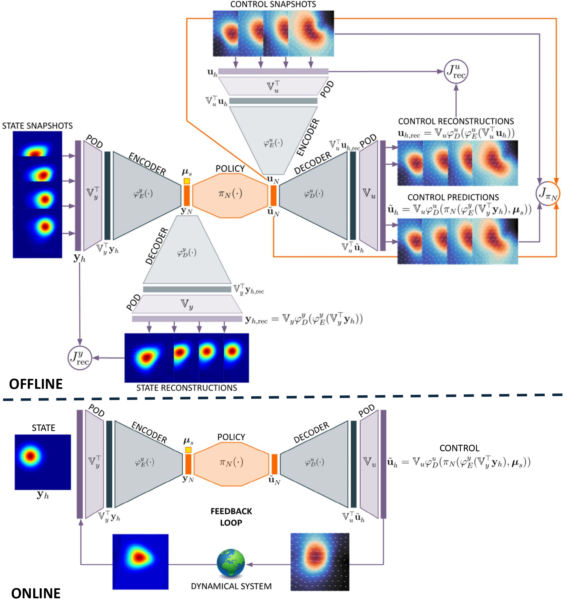
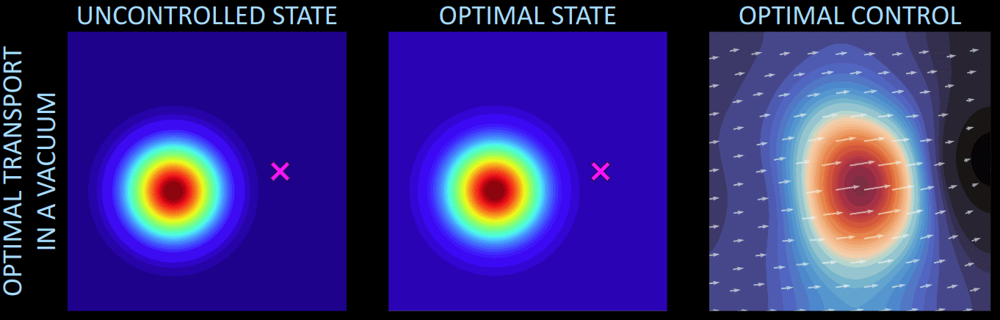
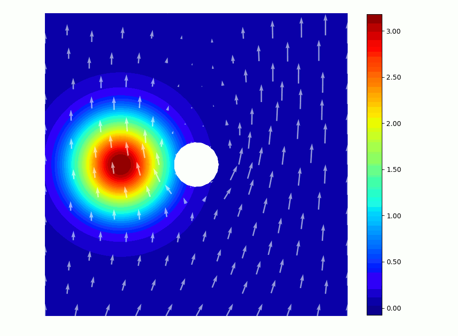

# Latent feedback control

This repository contains the official source code implementation of the paper
*Latent feedback control of distributed systems in multiple scenarios through deep learning-based reduced order models* ([arXiv](https://doi.org/10.48550/arXiv.2412.09942)).

`Data` folder contains the scenario parameters and the simulated snapshots for the optimal transport test cases;

`NN` folder contains the autoencoders, the policies and the forward maps built and trained in the optimal transport test cases;

To run the test cases, the library [dlroms](https://github.com/MatteoTomasetto/dlroms) is required to handle meshes, finite element spaces, neural networks and proper orthogonal decomposition.

<p align="center" width="100%">
  
  <br />
</p>

## Optimal transport in a vacuum
`OptimalTransportVacuum.ipynb` presents the optimal transport in a vacuum test case where the state, whose dynamics is described by the Fokker-Planck equation, is moved towards a target position. Different starting configurations and final endpoints may be considered. The control action is the velocity field on the entire domain.

<p align="center" width="100%">
  
  <br />
</p>

## Optimal transport in a fluid
`OptimalTransportFluid.ipynb` presents the optimal transport in a fluid test case where the state, whose dynamics is described by the Fokker-Planck equation, is moved towards a target position. Different starting configurations, final endpoints and underlying fluid flows may be considered. The control action is the velocity field on the entire domain.

<p align="center" width="100%">
  
  <br />
</p>

## Cite
If you use this code for your work, please cite

```
@misc{tomasetto2024latent-feedback-control,
      title={Latent feedback control of distributed systems in multiple scenarios through deep learning-based reduced order models}, 
      author={Matteo Tomasetto and Francesco Braghin and Andrea Manzoni},
      year={2024},
      eprint={2412.09942},
      archivePrefix={arXiv},
      primaryClass={math.OC},
      url={https://arxiv.org/abs/2412.09942}, 
}
```
