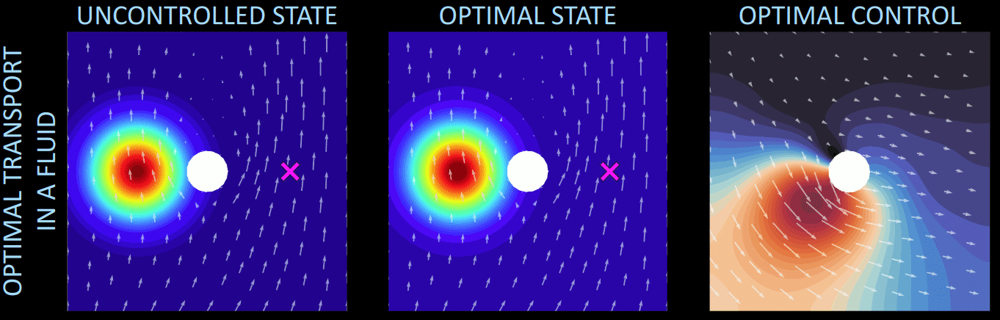

# Latent feedback control

This repository contains the official source code implementation of the paper
*Latent feedback control of distributed systems in multiple scenarios through deep learning-based reduced order models* ([arXiv](https://doi.org/10.48550/arXiv.2412.09942), [paper](https://doi.org/10.1016/j.cma.2025.118030)).

`Data` folder contains the scenario parameters and the simulated snapshots for the optimal transport test cases;

`NN` folder contains the autoencoders, the policies and the forward maps built and trained in the optimal transport test cases;

To run the test cases, the library [dlroms](https://github.com/MatteoTomasetto/dlroms) is required to handle meshes, finite element spaces, neural networks and proper orthogonal decomposition.

<p align="center" width="100%">
  
  <br />
</p>


## Quickstart

```python
import torch
import numpy as np

# Generate or import the data matrices Y and U collecting optimal state and control snapshots, respectively, along with the corresponding scenario parameters MU
# Define the number of trajectories np, the number of parameters nparam, the full-order state and control dimensions ny and nu, the number of timesteps ntimesteps and the time step size dt

# Initialize OCP object
from dlroms.ocp import OCP
ocp = OCP(ntrain) # ntrain is the number of training data

# Define error metrics
from dlroms.roms import mre, mse, euclidean
mse = mse(euclidean)
mre = mre(euclidean)
```

```python
# Preliminary POD state reduction
ry = ... # Number of state POD modes
ay, Y_rec, Psi_y, sigma_y = ocp.POD(Y, k = ry) # Only the first ntrain data used for training. ay are the POD coefficients, Y_rec the encoded-decoded data, Psi_y and sigma_y are the POD modes and singular values

# Preliminary POD control reduction
ru = ... # Number of control POD modes
au, U_rec, Psi_u, sigma_u = ocp.POD(U, k = ru) # Only the first ntrain data used for training. au are the POD coefficients, U_rec the encoded-decoded data, Psi_u and sigma_u are the POD modes and singular values
```

```python
# State autoencoder definition
from dlroms.dnns import Dense
hy = ... # Latent state dimension
encoder_y = Dense(ry, ...) + Dense(..., ...) + Dense(..., hy)
decoder_y = Dense(hy, ...) + Dense(..., ...) + Dense(..., ry, activation = None)
autoencoder_y = encoder_y + decoder_y

# Control autoencoder definition
hu = ... # Latent control dimension
encoder_u = Dense(ru, ...) + Dense(..., ...) + Dense(..., hu)
decoder_u = Dense(hu, ...) + Dense(..., ...) + Dense(..., ru, activation = None)
autoencoder_u = encoder_u + decoder_u

# Latent policy definition
policy = Dense(hy + nparams, ...) + Dense(..., ...) + Dense(..., hu, activation = None)
```

```python
# Neural network training - full-order feedback loop
ocp.latent_policy(ay, au, MU, encoder_y, decoder_y, encoder_u, decoder_u, pi_z, epochs = ..., weights = [..., ..., ...], loss = mse, error = mre) # Only the first ntrain data used for training. Weights are the cumulative loss function weights.
```

```python
from dlroms.roms import projectdown, projectup # POD encoding and decoding

# Define test scenario parameters and initial state
MU_test = ...
Y0 = ...
Y_test = []
Y_test.append(Y0)

# Full-order feedback loop
for k in range(ntimesteps): # For every timestep
    zy_test = encoder_y(projectdown(Psi_y, Y_test[k]).squeeze(2))
    zu_test_hat = pi_z(torch.cat((zy_test, MU_test), 1))
    u_test_hat = projectup(Psi_u, decoder_u(zu_test_hat))
    # Apply the predicted control to the system and advance the dynamics retrieving the state Y1 = forward_model(u_test_hat, Y_test[k], dt)
    Y_test.append(Y1)
```

```python
# Latent forward model definition
phi = Dense(nparams + hy + hu, ...) + Dense(..., ...) + Dense(..., hy, activation = None)

# Neural network training - latent feedback loop
ocp.latent_loop(np, ay, au, MU, encoder_y, decoder_y, encoder_u, decoder_u, policy, phi, epochs = ..., weights = [..., ..., ..., ..., ..., ...], loss = mse, error = mre) # Only the first ntrain data used for training. Weights are the cumulative loss function weights.

# Define test scenario parameters and initial state
MU_test = ...
Y0 = ...
Y_test = []
Y_test.append(Y0)

# Latent feedback loop
for k in range(ntimesteps): # For every timestep
    zy_test = encoder_y(projectdown(Psi_y, Y_test[k]).squeeze(2))
    zu_test_hat = pi_z(torch.cat((zy_test, MU_test), 1))
    u_test_hat = projectup(Psi_u, decoder_u(zu_test_hat))
    Y_test.append(project_up(Psi_y, decoder_y(phi_z(torch.cat((zu_test_hat, zy_test, MU_test),1))))) # Predict the next state through the latent forward model 
```

## Optimal transport in a vacuum
`OptimalTransportVacuum.ipynb` presents the optimal transport in a vacuum test case where the state, whose dynamics is described by the Fokker-Planck equation, is moved towards a target position. Different starting configurations and final endpoints may be considered. The control action is the velocity field on the entire domain.

<p align="center" width="100%">
  
  <br />
</p>

## Optimal transport in a fluid
`OptimalTransportFluid.ipynb` presents the optimal transport in a fluid test case where the state, whose dynamics is described by the Fokker-Planck equation, is moved towards a target position. Different starting configurations, final endpoints and underlying fluid flows may be considered. The control action is the velocity field on the entire domain.

<p align="center" width="100%">
  
  <br />
</p>

## Cite
If you use this code for your work, please cite

```bibtex
@article{tomasetto-latentfeedbackcontrol2025,
title = {Latent feedback control of distributed systems in multiple scenarios through deep learning-based reduced order models},
journal = {Computer Methods in Applied Mechanics and Engineering},
volume = {442},
pages = {118030},
year = {2025},
issn = {0045-7825},
doi = {https://doi.org/10.1016/j.cma.2025.118030},
url = {https://www.sciencedirect.com/science/article/pii/S0045782525003020},
author = {Matteo Tomasetto and Francesco Braghin and Andrea Manzoni}
}
```
