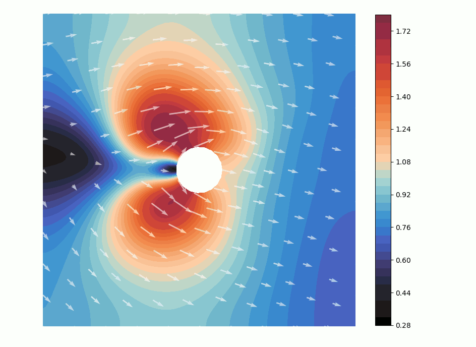

# DL-ROM in the loop

This repository contains the official source code implementation of the paper
*DL-ROM in the loop: a deep learning-based reduced order feedback control of high-dimensional parametrized systems*

`Data` folder contains the scenario parameters and the simulated snapshots for the optimal transport test cases

`NN` folder contains the autoencoders, the policies and the forward maps built and trained in the optimal transport test cases

To run the test cases, the library [dlroms](https://github.com/MatteoTomasetto/dlroms) is required to handle meshes, finite element spaces, neural networks and proper orthogonal decomposition.
This library is a fork of the [dlroms](https://github.com/NicolaRFranco/dlroms.git) library, that is written and currently maintained by [Nicola Rares Franco](https://github.com/NicolaRFranco), Ph.D., MOX, Politecnico di Milano.

## Optimal transport in a vacuum
`OptimalTransportVacuum.ipynb` presents the optimal transport in a vacuum test case where the state, whose dynamics is described by the Fokker-Planck equation, is moved towards a target position. Different starting configurations and final endpoints may be considered. The control action is the velocity field on the entire domain.

  
    
  
   
  Optimal state and control trajectory provided by the deep learning-based reduced order feedback controller corresponding to the initial position (−0.24, −0.14) and the target position (0.48,−0.03) in the test set 

  
    
  
   
  Optimal state and control trajectory provided by the latent feedback loop corresponding to the initial position (−0.24, −0.14) and the target position (0.48,−0.03) in the test set 

## Optimal transport in a fluid
`OptimalTransportFluid.ipynb` presents the optimal transport in a fluid test case where the state, whose dynamics is described by the Fokker-Planck equation, is moved towards a target position. Different starting configurations, final endpoints and underlying fluid flows may be considered. The control action is the velocity field on the entire domain.

  
    
  
   
  Optimal state and control trajectory provided by the deep learning-based reduced order feedback controller corresponding to the initial position (−0.5, 0.0), the target position (0.5, 0.0), inflow velocity intensity and angle of attack equal to, respectively, $0.5$ and $0.5$

  
    
  
   
  Optimal state and control trajectory provided by the latent feedback loop corresponding to the initial position (−0.5, 0.0), the target position (0.5, 0.0), inflow velocity intensity and angle of attack equal to, respectively, $0.5$ and $-0.5$

